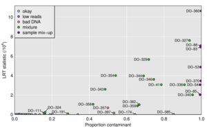

---
layout: frontpage
title: Karl Broman
keywords: Broman, QTL, R/qtl, quantitative trait loci, statistics, statistical genetics, recombination
---

  

      <ul class="nav">
          <li><a href="{{ BASE_PATH }}/broman_cv.pdf">cv</a></li>
          <li><a href="https://github.com/kbroman">github</a></li>
          <li><a href="https://kbroman.org/blog">blog</a></li>
          <li><a rel="me" href="https:///fosstodon.org/@kbroman">mastodon</a></li>
      </ul>
  

<table class="wide">
<tr>
  <td class="left">
    
  </td>
  <td class="right">
    
  </td>
</tr>
<tr>
  <td class="left">
    
  </td>
  <td class="right">
    
  </td>
</tr>
</table>

Highlights

- More than nine years of experience in data science starting from ideation and research to product development and product maintenance
- Vast experience with machine learning (supervised, unsupervised, semi-supervised)
- Experience in deep learning (convolutional neural networks, recurrent neural networks, transformer models)
- Comprehensive experience with various databases (MSSQL/Postgres, MongoDB, Neo4j, DynamoDB/Athena, Big Query, ElasticSearch)
- Significant experience with big data analytics such as Apache Spark (PySpark, Scala), Hive, Hadoop
- Substantial experience in Data Visualization, Natural Language Processing, Speech Analytics, Signal Processing, Computer Vision
- Diverse and well-rounded skills in handling various datasets: transactional data, application interaction data, content data, healthcare claims data, clinical data, physiological data, wearable signal data, text data, audio data, images, videos, etc.)
